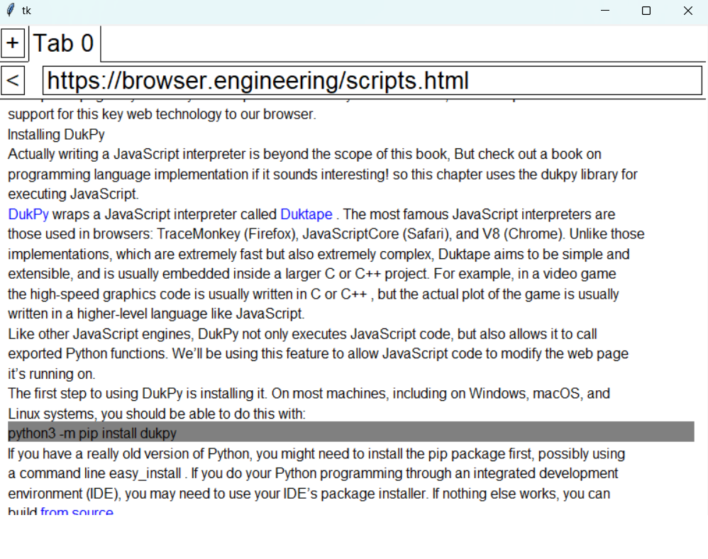

# Web Browser Project - Work in Progress

Welcome to my Web Browser Project! This is an ongoing learning journey where I am building a web browser from scratch to explore and understand the inner workings of modern web browsers.

### **Project Overview**
The primary goal of this project is to dive deep into the core components that make up a web browser. Through this project, I am teaching myself the internals of web browsers, including HTML rendering, CSS parsing, JavaScript execution, and the overall browser architecture.

This browser is built using **Python** and **Tkinter** (a Python GUI toolkit), following along with the code & concepts discussed in [Web Browser Engineering](https://browser.engineering/). I'm currently reviewing Part 1, 2, and 3 before moving on to Part 4. I’ve also added detailed comments to facilitate learning and future development.

### **Key Features**
This project currently includes the following features:
- **Core URL Management**: Handles URLs and routing requests.
- **HTML Parsing**: Parses and interprets HTML content.
- **CSS Parsing**: Processes and applies CSS styles to HTML elements.
- **Styling and Layout**: Implements basic page styling and layout rendering.
- **Painting and Drawing Commands**: Responsible for rendering content on the screen.
- **Browser Interface**: Basic graphical user interface for interacting with the browser.

### **Areas for Improvement**
While the project has made significant progress, there are a few areas still under development:
- **Form Rendering Issue**: Forms aren’t showing up correctly—instead of seeing input fields and buttons, the browser just spits out the raw HTML for the form. This could be an issue with the HTML parsing or how forms are processed in general.
- **Heading Styling**: Headings (h1, h2, etc.) don’t look like headings. They aren’t bold, and their font sizes aren’t bigger. I’m not sure if this is because the HTML parser isn’t recognizing them properly or if the CSS parser isn’t applying styles correctly.
- **CSS Improvements**: The browser doesn’t handle much CSS right now, so improving how it parses and applies styles is definitely on my to-do list.

### **Future Goals**
- Support for Forms
- Style Headings Properly
- Better CSS Support
- Enhance JavaScript execution capabilities.

---

> **Note**: This project is a work-in-progress and is being updated as I continue to learn and develop more browser components.
